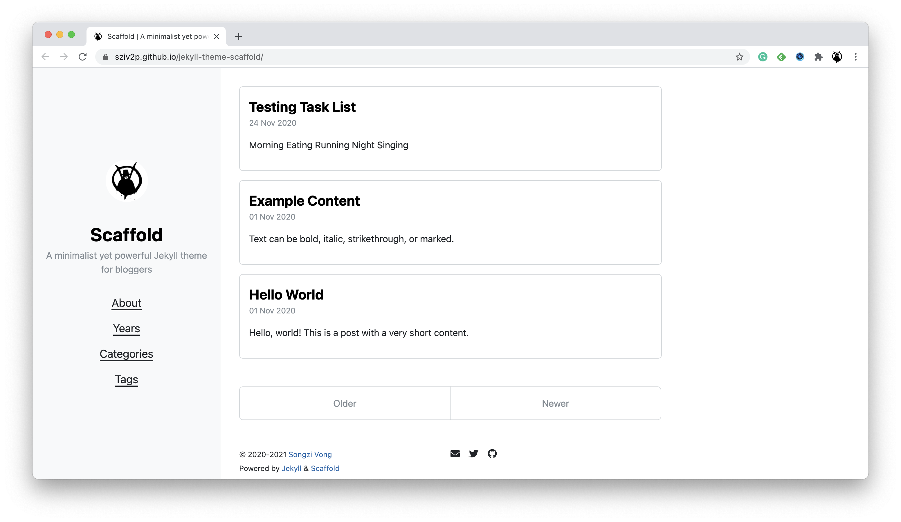
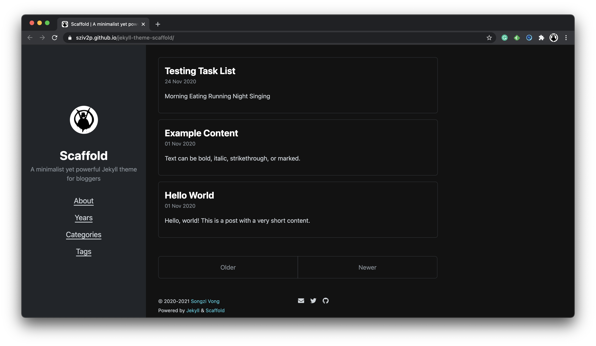

# Scaffold <!-- omit in toc -->

<a href="https://jekyll-themes.com">
  
</a>

Scaffold is a *minimalist yet powerful Jekyll theme for bloggers*.

According to [Merriam-Webster](https://www.merriam-webster.com/), a *scaffold* is

> a temporary or movable platform for workers (such as bricklayers, painters, or miners) to stand or sit on when working at a height above the floor or ground

So is the target of the Jekyll theme Scaffold. It doesn't need to be modern, colorful, or beautiful; It just needs to be **simple**, **proper**, **naked**, and **neat**.

Scaffold is empirical. Standing on it, you -- the blogger -- can build a great building based on your words.

*Check the [live demo](https://sziv2p.github.io/jekyll-theme-scaffold/).*




## Features (Not a Complete List) <!-- omit in toc -->

- [Normalize.css](http://necolas.github.io/normalize.css/)
- [Open Color](https://yeun.github.io/open-color/)
- Dark mode, via [`prefers-color-scheme`](https://developer.mozilla.org/en-US/docs/Web/CSS/@media/prefers-color-scheme)
- [Font Awesome](https://fontawesome.com/)
- Archive implemented by pure Liquid
- Pagination, via [`jekyll-paginate`](https://rubygems.org/gems/jekyll-paginate)
- TOC, via [`jekyll-toc`](https://github.com/allejo/jekyll-toc)
- [Jekyll Feed](https://github.com/jekyll/jekyll-feed/)
- [Jekyll SEO Tag](https://github.com/jekyll/jekyll-seo-tag/)
- [Jemoji](https://github.com/jekyll/jemoji)
- [Google Analytics](https://analytics.google.com/)
- [Disqus](https://disqus.com/)
- [MathJax](https://www.mathjax.org/)

## Table of Contents <!-- omit in toc -->

- [Installation](#installation)
- [Usage](#usage)
  - [Global Configuration](#global-configuration)
  - [Post Configuration](#post-configuration)
  - [Homepage](#homepage)
  - [Navigation](#navigation)
  - [Social Links](#social-links)
  - [Archive](#archive)
  - [Custom Head](#custom-head)
- [Contributing](#contributing)
- [Development](#development)
- [License](#license)

## Installation

Add this line to your Jekyll site's `Gemfile`:

```ruby
gem "jekyll-theme-scaffold"
```

And add this line to your Jekyll site's `_config.yml`:

```yaml
theme: jekyll-theme-scaffold
```

And then execute:

    bundle

Or install it yourself as:

    gem install jekyll-theme-scaffold

If you want to use this theme on GitHub Pages, you can do that via `jekyll-remote-theme`:

1. Import `jekyll-remote-theme` in your `Gemfile`:

    ```ruby
    gem "jekyll-remote-theme"
    ```

2. Add these lines to your `_config.yml`:

    ```yml
    plugins:
      - jekyll-remote-theme

    remote_theme: sziv2p/jekyll-theme-scaffold
    ```

## Usage

The main usage of this theme is described in detail below. If you find the document difficult to understand or not specific enough, you can also use the [`gh-pages`](https://github.com/sziv2p/jekyll-theme-scaffold/tree/gh-pages) branch of this repository as an example to learn how to use this theme.

### Global Configuration

| Variable | Type | Default | Specification |
| -------- | ---- | ------- | ------------- |
| `title` | String | --- | The title of the website |
| `tagline` | String | --- | The tagline of the website |
| `lang` | String | `en` | The language of pages; The value can be overwritten by the `lang` variable on each page |
| `author.name` | String | --- | The name of the website author |
| `author.url` | String | --- | A URL of the website author |
| `author.avatar` | String | --- | The path to author's avatar resource |
| `date_format` | String | `%-d %b %Y` | The [date format](http://alanwsmith.com/jekyll-liquid-date-formatting-examples) which is used in many places on the website |
| `tags_path` | String | --- | A path to the archive-by-tags page; It is used by tags on each post |
| `google_analytics` | String | --- | Google Analytics tracking ID |
| `disqus` | String | --- | Disqus short name |

### Post Configuration

| Variable | Type | Default | Specification |
| -------- | ---- | ------- | ------------- |
| `description` | String | --- | A description of the current post |
| `last_modified_at` | String | --- | The date of the last modification you made on a post after its publishing |
| `author` | String or Array | --- | The author name(s) of the post |
| `math` | Boolean | `false` | Does enable MathJax on this page |
| `comments` | Boolean | `true` | Does enable the Disqus comment system |
| `toc` | Boolean | `false` | Does enable the TOC |

### Homepage

You can create a homepage for your blog by setting `layout: home` in your `index.html`.

### Navigation

You can configure the navigation of the website by creating a file `_data/navigation.yml` in your repository, and put some data such as below into it.

```yml
- title: About
  url: /about/
- title: Archive
  url: /archive/
```

### Social Links

Scaffold allows you to show social links on the website, all you need to do is creating a file `_data/social.yml`, for example,

```yml
- title: Email
  url: mailto:sziv2p@gmail.com
  icon: fas fa-envelope
- title: Twitter
  url: https://twitter.com/sziv2p
  icon: fab fa-twitter
- title: GitHub
  url: https://github.com/sziv2p
  icon: fab fa-github
```

The `icon` property means a [Font Awesome](https://fontawesome.com/) class, and you can select any one you like.

### Archive

Pure provides some built-in archive pages. It is implemented in pure Liquid. If you want to archive posts by years, you can create a page and put these code in it:

```yml
---
layout: archive
type: years
---
```

Similarly, if you want to archive posts by categories or tags, you can set the `type` property as `categories` or `tags`.

### Custom Head

Pure leaves a placeholder to allow defining custom head. All you need to do is putting data into `_includes/custom-head.html`, and they would be automatically included in `<head>`.

## Contributing

Bug reports and pull requests are welcome on GitHub at [https://github.com/sziv2p/jekyll-theme-scaffold](https://github.com/sziv2p/jekyll-theme-scaffold). This project is intended to be a safe, welcoming space for collaboration, and contributors are expected to adhere to the [Contributor Covenant](http://contributor-covenant.org) code of conduct.

## Development

To set up your environment to develop this theme, run `bundle install`.

Your theme is setup just like a normal Jekyll site! To test your theme, run `bundle exec jekyll serve` and open your browser at `http://localhost:4000`. This starts a Jekyll server using your theme. Add pages, documents, data, etc. like normal to test your theme's contents. As you make modifications to your theme and to your content, your site will regenerate and you should see the changes in the browser after a refresh, just like normal.

When your theme is released, only the files in `_layouts`, `_includes`, `_sass` and `assets` tracked with Git will be bundled.
To add a custom directory to your theme-gem, please edit the regexp in `jekyll-theme-scaffold.gemspec` accordingly.

## License

The theme is available as open source under the terms of the [MIT License](https://opensource.org/licenses/MIT).
